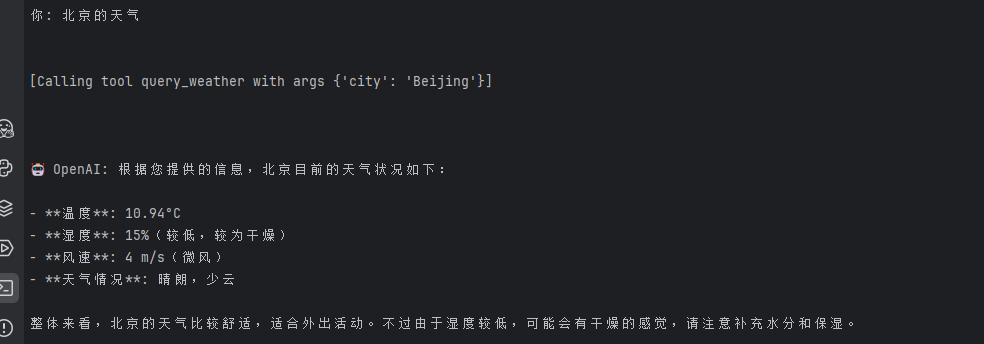

1. 先安装uv
```
pip install uv
```
2. 安装mcp依赖
```
pip insatll mcp
```

3. 启动命令
```bash
uv run client.py server.py
```

4. 启动后在控制台进行对话



   
# 参考资料

https://modelcontextprotocol.io/quickstart/server
https://modelcontextprotocol.io/quickstart/client
