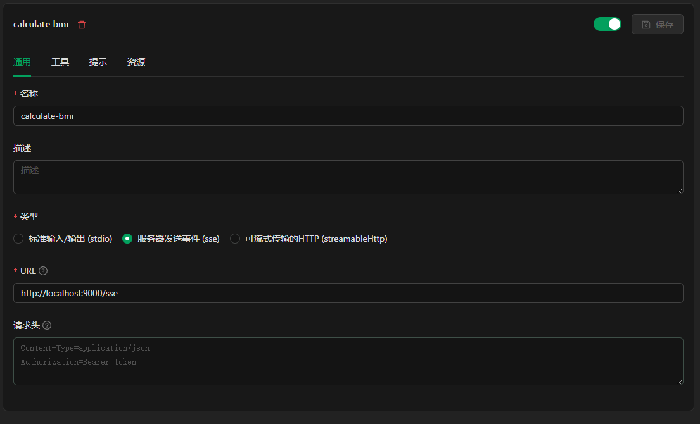
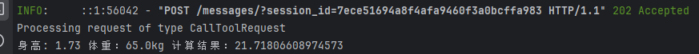

1. 启动server

```
uvicorn calculate-bmi-server:app --host localhost --port 9000
```

启动命令里是的calculate-bmi-server就是py文件名，app就是代码里的 app = Starlette这一段。


2. 使用浏览器访问，ip:端口/sse


3. 在cherry studio配置sse接口



4. 对话


server日志打印



# 参考资料：
https://zhuanlan.zhihu.com/p/1890120742873568319